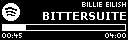
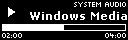
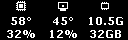
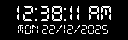

# 🎹 OLED Customizer

**Turn your SteelSeries OLED into a live music, system, and productivity dashboard.**

Media playback, hardware stats, volume control, and a calculator — all rendered in real time on your keyboard's 128×40 OLED with zero flicker.

---

## 📋 Table of Contents

- [🎵 Media Dashboard](#-media-dashboard)
- [🌡️ Ghost-Monitor](#️-ghost-monitor)
- [🔊 Volume & Mute](#-volume--mute)
- [🧮 Calculator](#-calculator)
- [🕰️ Clock Styles](#️-clock-styles)
- [🛠️ Quick Setup](#️-quick-setup)
- [🎵 Spotify API Setup](#-spotify-api-setup)
- [🌐 Browser Sync](#-browser-sync-installation)
- [📚 Acknowledgments](#-acknowledgments)

---

## 🎵 Media Dashboard

- **Spotify & YouTube** — Live track info via Spotify API or Browser Sync (SMTC).
- **Auto-Switch** — Falls back to the clock when nothing is playing.
- **Pixel-Perfect Icons** — Custom icons sized for the 128×40 display.

| Spotify | YouTube | Generic Media |
| :---: | :---: | :---: |
|  |  |  |

## 🌡️ Ghost-Monitor

Tap **INS** to overlay live system stats on any screen.

- CPU & GPU usage and temps
- RAM at a glance
- Hand-drawn 12×12 pixel art icons

## 🔊 Volume & Mute

- **Adaptive Icons** — Icon changes with volume level.
- **Discord-Aware** — Mic icon appears when Discord is active.
- **Global Mic Mute** — Press **PAUSE**, or bind **Mouse 4 / Mouse 5** in Settings.
- **Nuclear Mute** — Mutes every active microphone if the default isn't found.

## 🧮 Calculator

Press **Ctrl + INS** (or toggle via the System Tray) to open a Win11-style calculator on your OLED.

- Full numpad input with `+` `-` `*` `/` `(` `)`
- OS-level key suppression while active — numpad keys won't leak into other apps
- Locale-aware decimal (both `.` and `,`)

## 🕰️ Clock Styles

Configure via `%APPDATA%/OLED Customizer/config.json` or the **Settings GUI**.

| Style | Preview |
| :--- | :--- |
| **Standard** |  |
| **Analog** |  |
| **Big Timer** |  |
| **Date Focused** |  |

---

## 🛠️ Quick Setup

> [!IMPORTANT]
> Run as **Administrator** so hardware sensors (CPU/GPU temps) can be read.

### Requirements

- **SteelSeries GG** (Engine 3 or newer)
- **Windows 10/11**
- **Spotify Account** — only needed for Spotify integration

### Getting Started

1. Download **`OLED-Customizer.exe`** from the [latest release](https://github.com/0z-zy/OLED_Customizer/releases/latest).
2. Run it — the app lives in your System Tray.
3. **Right-click the tray icon** to open settings.

---

## 🎵 Spotify API Setup

> [!TIP]
> Takes about 2 minutes. Much more reliable than standard Windows media detection.

### 1. Create Your App

1. Open the [Spotify Developer Dashboard](https://developer.spotify.com/dashboard).
2. Click **"Create app"**:
    - **Redirect URI**: `http://127.0.0.1:2408/callback`
    - **API/SDK**: select **Web API**

### 2. Configure Credentials

1. Copy your **Client ID** and **Client Secret**.
2. In **OLED Customizer Settings**, enable **Spotify Integration**, paste the credentials, and set the port to `2408`.
3. Click **SAVE** and restart.

---

## 🌐 Browser Sync Installation

1. Download **`OLED-Customizer-Extension.crx`** from the [latest release](https://github.com/0z-zy/OLED_Customizer/releases/latest).
2. Open `chrome://extensions` or `edge://extensions`.
3. Enable **Developer mode** (top-right toggle).
4. **Drag & drop** the `.crx` file onto the page.

> [!NOTE]
> Browser Sync bypasses SMTC limitations, giving you accurate progress bars and metadata for YouTube.

---

## 📚 Acknowledgments

Originally inspired by [SteelSeries-Spotify-Linker](https://github.com/Firewee/SteelSeries-Spotify-Linker).

- **Backend** — GameSense™ SDK
- **Sensors** — LibreHardwareMonitor
- **Icons** — Hand-crafted 128×40 pixel art

---

**Built for enthusiasts by [0z-zy](https://github.com/0z-zy).**
